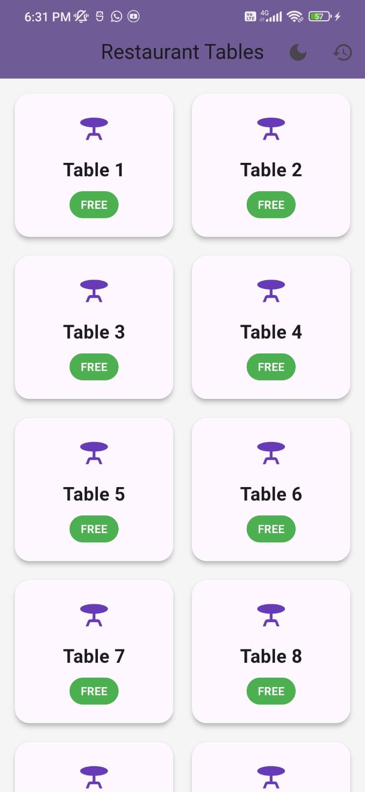
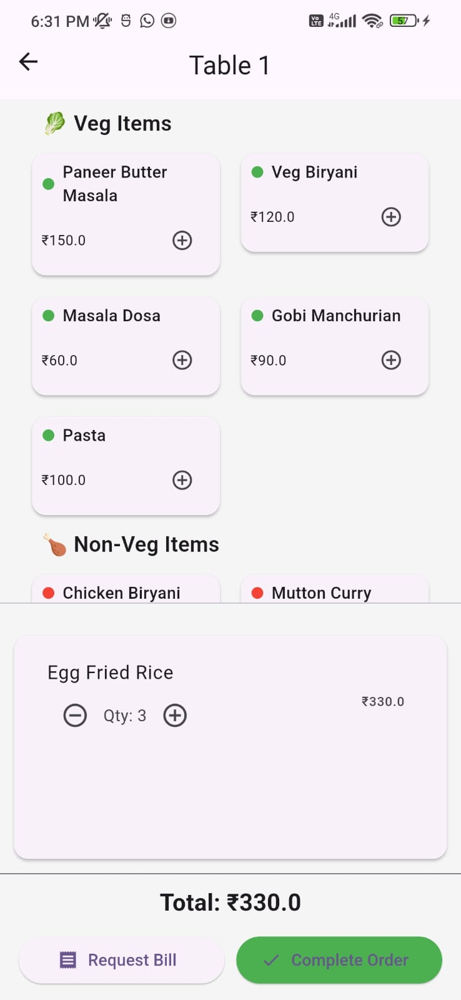
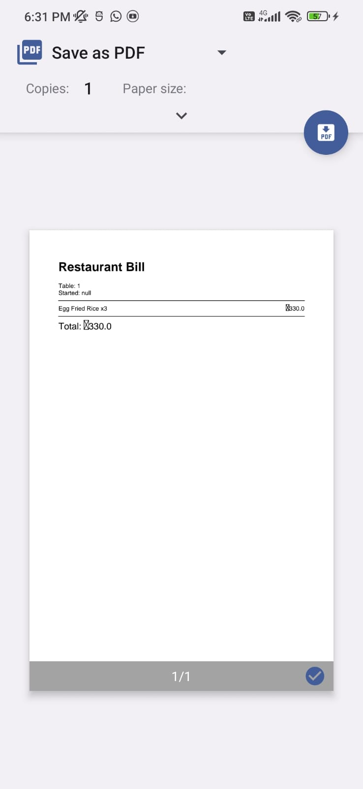

# 🍽️ sample_app1 - Flutter Restaurant Order App

A complete restaurant order management app built using **Flutter**, **SQLite**, and **Riverpod**. It enables waiters to take orders, manage table status, and persist data locally with SQLite.

---

## 🏗️ Architecture Overview

This app follows a simple **MVVM-style architecture** using:

### 📁 `models/`
- `MenuItem`: Represents individual food items
- `OrderItem`: Food items with quantity added to a table
- `TableOrder`: Represents each table’s orders and status

### 📁 `providers/`
- `tablesProvider`: Manages all table-related state (status, items)
- `themeProvider`: Switch between light/dark mode

### 📁 `db/`
- `DatabaseHelper`: SQLite logic for persisting orders and table statuses

### 📁 `screens/`
- `HomeScreen`: List of tables with their status
- `OrderScreen`: Add/remove items and request bills
- `OrdersViewScreen`: View completed orders

---

## 🧠 Assumptions

- The restaurant has **10 static tables**
- All menu items are hardcoded for simplicity
- Table statuses (`Free`, `Occupied`, `Requesting Bill`) are saved in SQLite
- A table becomes `Occupied` when items are added
- Orders are stored in SQLite when bill is requested
- The app works **offline**
- Data remains even after app restart

---

## ✅ Features

- View table statuses (Free / Occupied / Requesting Bill)
- Add/remove items to/from a table
- Automatically change table status
- Request bill and persist orders
- View past orders
- Light/dark mode toggle
- SQLite persistence of all table statuses

---

## 🚀 Getting Started

1. **Clone the repo:**
   ```bash
   git clone https://github.com/Santhiyagj/sample_app1.git
   cd sample_app1
   flutter pub get
   flutter run

## 📦 Build APK
To generate a release APK for Android:

bash
flutter build apk --release

The APK will be located at:

swift
build/app/outputs/flutter-apk/app-release.apk

**💡 Tech Stack **
Category	Package
UI Framework	Flutter
State Management	Riverpod
Local Database	SQLite (sqflite)
Path Support	path_provider
PDF Generation	pdf, printing, share_plus
Theming	Flutter ThemeMode

👤 Author
Santhiyag J
GitHub: @Santhiyagj

📄 License
This project is licensed under the MIT License.

You are free to use, modify, and distribute this software with attribution.

yaml


---

✅ You can now:

- Save this content as your `README.md`
- Add screenshots under `assets/screenshots/`
- Upload demo video to YouTube and update `YOUR_VIDEO_ID`

Let me know if you want help creating a professional `LICENSE` file or uploading APK/demo!


## 📸 Screenshots

| Home Screen | Order Screen | Bill Screen |
|-------------|--------------|-------------|
|  |  |  |

